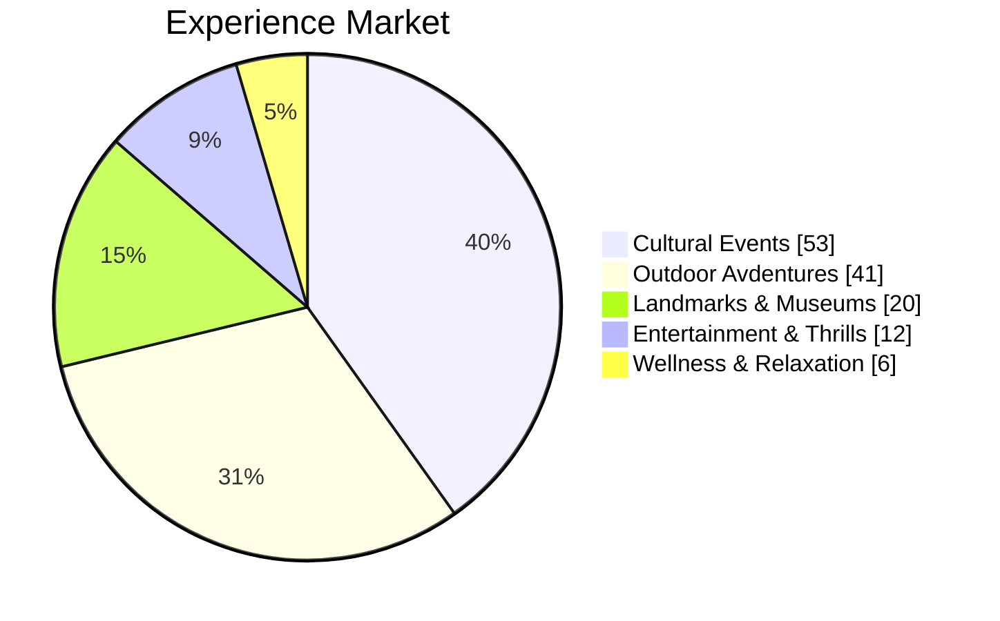
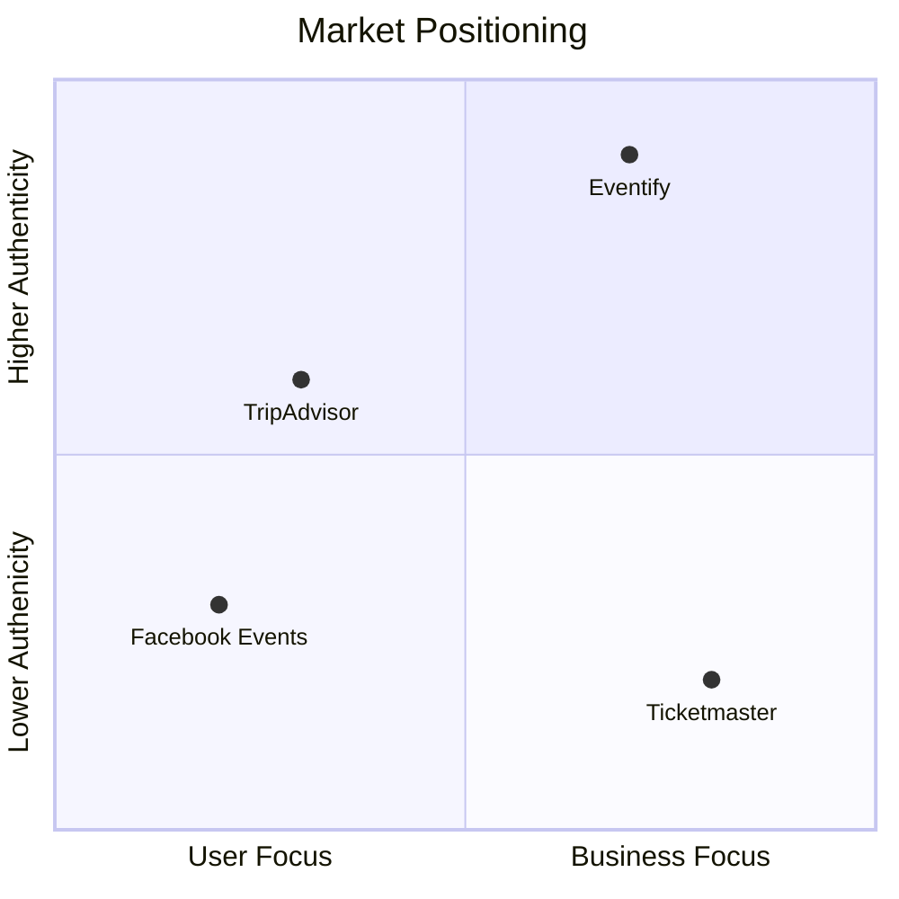

# Eventify

## Centralizing Authentic Local Experiences

<!--
- fix some grammar and spelling
- fix invisible table
- do the style thing to make it not poop
-->

<!--
2 minutes
We're building a platform to
connect people with unique, local events and give small businesses a direct
line to their community.
-->

---
color: violet-light
layout: full
hideInToc: true
---

# Presentation Overview

<Toc maxDepth="1" columns="1" />

---
layout: section
color: violet
---

# Introduction & Market Overview

---
color: violet
layout: side-title
side: right
align: lm-rm
---

:: title ::

<!-- --- -->
<!-- src: ./pages/slides.md -->
<!-- --- -->
## The Local Event Discovery Problem

:: default ::

## Scattered and Overlooked
- Problem: Finding unique local events is a challenge.
- Users juggle multiple platforms.
- Small businesses struggle for visibility.
- Existing platforms prioritize major events.
- Leading to missed opportunities for everyone.

<!-- TODO: make the underlines happen all at once -->

<!--
2 minutes

"Today, finding truly unique local events is a challenge. Users juggle multiple
platforms, while small businesses struggle for visibility. For instance, consider a local bake sale, while they may put up posters in their neighborhood, it would likely be drowned out on a platform like Facebook Marketplace. Existing platforms prioritize major events, overshadowing
authentic, community-driven experiences and what many consider to be tourist
traps. Consider our very own CN Tower. While a magnificent piece of engineering and architecture, going up into the tower itself is quite underwhelming.
This disconnect
results in missed opportunities for users and limited reach for local
organizers."
-->

---
layout: top-title-two-cols
color: violet
---

:: title ::

## The Growing Local Experience Economy

:: left ::

 
 

- Local experiences markets are rising.
- Goal: Capture the small-scale segment.
- Providing links to true, local events.

:: right ::

 
 

<!--
"The market for local experiences is expanding rapidly. We aim to capture the
underserved segment of small-scale events ($53 billion dollar market globally; as estimated by McKinsey and Company). The total global experience market is worth 1.3 trillion. Our focus is travellers who are craving to tap into true cultural experiences. Eventify provides direct links to people seeking *authentic local cultural
events*."
-->

---
layout: section
color: violet
---

# Our Solution

---
color: violet-light
layout: top-title
---

:: title ::

## Eventify
### Your Single Source for Authentic Local Connection

:: default ::

-  Aggregating and centralizing local event information.
-  Focus: Unique experiences by locals around the world.
-  Creating a two-way stream for users and owners.

<!--
3 minutes

Eventify addresses fragmentation in event discovery by centralizing diverse local experiences on a single platform. Our system aggregates authentic local events that travelers might otherwise miss.

Unlike competitors, we specifically focus on genuine cultural experiences created by locals for a global audience. This authenticity is our key differentiator in the market.

Our platform works through a two-way marketplace: travelers gain access to unique local events, while small businesses and event organizers reach an interested audience without competing against commercial attractions.

This symbiotic relationship drives organic growth on both sides of our platform.
-->

---
color: violet
layout: side-title
side: right
align: lm-lm
---

:: title ::

## Our Core Promise
### Connect People with Real Local Life

:: default ::

- Connect people with real local life.
- Giving local business and people the power to create unforgettable times!
- Easy. Genuine. Local.

<!--
At Eventify, our fundamental promise is connecting people with authentic local experiences. We go beyond superficial tourist attractions to facilitate genuine cultural immersion.

Eventify isn't just a platform; it's an ecosystem that supports authentic
community experiences.

We empower local businesses and community members to showcase their unique offerings directly to interested travelers. This creates economic opportunities while preserving cultural authenticity.

Our platform's design philosophy centers on three key values: Easy navigation and booking, genuine experiences verified by locals, and hyper-local focus that surfaces hidden gems in each community.

This combination creates a compelling alternative to mass-market tourism platforms and delivers on our core promise of real connection.
-->

---
layout: section
color: violet
---

# Demo Flows

---
layout: section
color: violet-light
---

## User Authentication

<!--
Security is paramount in our platform. We've implemented secure password-based authentication
with strong hashing and salting mechanisms, ensuring robust protection while maintaining a
frictionless user experience. Watch how quick and smooth the login process is.
-->

---
layout: default
color: violet-light
---

<IFrame src="http://localhost:5173/login" />

<!--
Notice the clean, intuitive interface. We've implemented comprehensive error handling
to guide users through the authentication process, making it as smooth as possible.
-->

---
layout: section
color: violet-light
---

## Main interface

---
layout: full
slide_info: false
---

<IFrame src="http://localhost:5173" :scale="0.7" />

<!--
The Eventify main interface demonstrates our commitment to clean, intuitive design.

The responsive design works across all devices, ensuring travelers can discover local experiences anywhere. This reflects our core values of accessibility and authenticity.
-->

---
layout: section
color: violet-light
---

## Booking

---
layout: full
slide_info: false
---

<IFrame src="http://localhost:5173/events/37" :scale="0.65" />

<!--
Our event booking page presents all critical information - description, venue, date, and capacity - in a clean, scannable format. The integrated map provides location context, while category tags enable quick filtering.

The simplified booking process reduces friction and increases conversion rates for event organizers.
-->

---
layout: section
color: violet-light
---

## Account Management

<!--
User privacy and control are core values. Our account management system gives users
complete transparency and control over their data and preferences.
-->

---
layout: full
slide_info: false
---

<IFrame src="http://localhost:5173/settings" :scale="0.7" />

<!--
Our account settings page provides straightforward profile management with clear visual hierarchy. Users can easily update personal information, manage credentials, and control security settings in one centralized location.
-->

---
layout: section
color: violet
---

# Technical Implementation

---
color: violet
layout: side-title
---

:: title ::

## Built for Scale

:: default ::

### Universal Accessibility
- Works across all devices and browsers
- Progressive enhancement for modern features

### Lightning-Fast Stack
- Modern frontend framework (SvelteKit)
- Optimized database (PostgreSQL)

### Scalable Architecture
- Built for rapid growth
- Easy maintenance and updates

<!--
- Universal accessibility shows we can reach all users
- Performance focus demonstrates we're ready for scale
- Modern stack proves we're built for the future

Eventify is built with a clever stack of technologies to make development fast, and users happy.

How do we do this, you ask? Svelte and SvelteKit take care of javascript
transformation to support a large amount of browsers (ran the project on a
15-year-old macbook, still functioned, though it didn't support a lot of the
CSS, but the site was still useable)

Another clever bit built into SvelteKit is progressive enhancement. By using
only technologies that run on all browsers we make sure that the site will be
useable and fast no matter their hardware, software and connection speed.
Behind the scenes, svelte will activate "progressive enhancement" to make the
ui elements more seamless on up-to-date browsers (~10yrs)

Another key technology in our stack that lets us move at the speed of code is
TailwindCSS. This magical little library contains many very simple CSS classes.
Rather than following the old recommendation of separation of concerns,
we can apply the styles right where we need to.

You may ask and wonder how refactoring style might work? Thankfully this is
really easy, every class can be overridden in your
tailwind.config.js and by using CSS variables.

Another abstraction that we get from SvelteKit is component CSS isolation. This
makes it very easy to style each component because each one has a separate
namespace. No more debugging styles and trying to figure out why your div isn't
max-with: 100% when it was caused by a piece of CSS from three components away.

Runtime: We are using a very well optimised javascript runtime called bun. It
is quite new (<2yrs) but has been proven to be very fast and efficient. It is
written in zig, a systems programming language that makes it easy to write fast
and stable code.

Using Bun's PG library, we can easily connect to our postgres database. This is
a very fast and reliable database that can be easily scaled up to meet the
demands of our growing user base.
-->

---
layout: section
color: violet
---

# Business Model

---
layout: side-title
side: right
color: violet
---

:: title ::
## A Sustainable Revenue Model

:: default ::

### Multi-Stream Revenue Model

- **Event Commission (7-13%)**
  - Scaled based on business size
  - Competitive rates to ensure affordability
- **Featured Event Promotion**
  - Premium placement in search results
  - Enhanced visibility for businesses
- **Targeted Advertising**
  - Local business focus
  - Contextual ad placement

<!--
The tiered commission structure ranges from 7-13%, scaling with business size to support local growth. Small businesses benefit from lower rates, while established venues contribute proportionally more.

Featured event promotion and targeted advertising provide additional revenue streams while enhancing visibility for participating businesses. This balanced approach maintains platform accessibility while driving sustainable growth.
-->

---
color: violet
layout: top-title-two-cols
---

:: title ::

## Revenue Model Breakdown

:: left ::

### Commission Structure

| Business Size | Commission Rate | Justification        |
|---------------|-----------------|----------------------|
| Small         | 7%              | Support local growth |
| Medium        | 10%             | Standard market rate |
| Large         | 13%             | Premium services     |

:: right ::

### Additional Revenue Streams
- Cooperative Event Facilitation Fee
- Featured Event Pricing Tiers
  - Basic Promotion: $50/event
  - Premium Placement: $150/event

<!--
Our revenue model is designed for sustainable growth while supporting local businesses.
The tiered commission structure ensures accessibility for small businesses while
capturing appropriate value from larger organizations. Additional revenue streams
provide diversification and growth potential.
-->

---
color: violet-light
layout: top-title
---

:: title ::

## Competitive Landscape

:: default ::

| Feature/Focus          | Eventify                | Facebook Events         | Meetup                 |
|-----------------------|-------------------------|------------------------|------------------------|
| Primary Audience      | Travelers seeking local experiences | Local community events | Regular group meetings |
| Event Discovery      | Curated local experiences | Algorithm-based feed   | Interest-based groups |
| Business Focus       | Small local businesses    | Mass market           | Community organizers  |
| Cultural Integration | High (local authenticity) | Limited               | Moderate             |
| Tourist Accessibility| Optimized for visitors   | Local-network dependent| Group-membership based|

<!--
TODO: make the table align with the slide
-->

<!--
Our competitive analysis reveals key differentiators in the event discovery market. While Facebook Events serves local communities and Meetup focuses on regular group meetings, Eventify uniquely targets travelers seeking authentic local experiences. As we operate in a niche market, we will be able to cater more to user's needs.

We excel in cultural integration and tourist accessibility, offering curated local experiences without requiring existing social networks. This positions us perfectly for the underserved market of travelers seeking genuine local connections.

Unlike mass-market platforms, our business focus on small local businesses ensures authentic, non-commercialized experiences.
-->

---
color: violet
layout: side-title
side: right
align: lm-lm
---

:: title ::

## Why Eventify?

:: default ::

**Authentic Local Experiences**

  

  * Created by locals, for everyone
  * Real cultural immersion

  

**Traveler-Centric Design**

  

  * Intuitive discovery
  * Seamless booking process

  

 

**Direct Business Connection**

  

  * No intermediary barriers
  * Support local economies

  

**Independent Platform**

  

  * No existing social network/account required
  * Open to all travelers

  

**Unique Event Focus**

  

  * Emphasis on one-time experiences
  * Authentic, non-commercialized events

  

<!--
Our authentic local experiences are curated by locals themselves, providing real cultural immersion rather than tourist attractions.

Our traveler-centric design focuses on intuitive discovery and seamless booking, eliminating common friction points.

We create direct business connections without intermediary barriers, actively supporting local economies.

As an independent platform, we don't require existing social networks - making us accessible to all travelers seeking unique, non-commercialized events.
-->

---
color: violet-light
layout: full
---

## Market Position

### Our Unique Position

### Key Differentiators
- Focused on authentic local experiences
- Optimized for travelers and locals alike
- Emphasis on unique, one-time events
- Direct community engagement

<!--
Our market positioning clearly demonstrates Eventify's unique value proposition. Looking at this quadrant chart, you can see we occupy a distinct position in the upper-right - combining authentic experiences with strong business focus.

Our key differentiators are clear: authentic local experiences, optimized for both travelers and locals, emphasis on unique events, and direct community engagement. This positioning addresses an underserved market segment while avoiding direct competition with established platforms.
-->

---
color: violet
layout: side-title
side: right
align: lm-lm
---

:: title ::

## Addressing Market Concerns

:: default ::

### Existing Platforms 
#### And What They Excel At
  - Large-scale concerts (Ticketmaster)
  - Friend gatherings (Facebook)
  - Tourist attractions (TripAdvisor)

### Our Unique Focus:
#### Local Business Empowerment
  - Direct venue-to-customer connection
  - Simple event creation and management
  - No social network barrier

<!--
While established platforms excel in specific areas - Ticketmaster for major concerts, Facebook for social gatherings, and TripAdvisor for tourist attractions - Eventify fills the gap by empowering local businesses with direct customer connections. We offer simplified event management for small operators and eliminate social network requirements, making authentic local experiences accessible to all travelers regardless of their existing connections.
-->

---
color: violet
layout: side-title
side: right
align: lm-lm
---

:: title ::

## Addressing Market Concerns

:: default ::

### Real-World Example: Local Pottery Workshop
  - Too small for Ticketmaster
  - Lost in Facebook's feed
  - Not tourist-focused enough for TripAdvisor
  - Perfect for Eventify

### Filling Critical Gaps
  - Small-scale, authentic experiences
  - Direct business control
  - Local discovery focus

<!--
Our pottery workshop example shows why Eventify matters: too small for Ticketmaster, lost in Facebook's feed, overlooked by TripAdvisor - yet exactly what many travelers seek. We fill this gap by showcasing authentic small-scale experiences and giving local businesses direct access to interested travelers.
-->

---
layout: section
color: violet
---

# Team

---
color: violet-light
---

## Five Member Team, Many Different Backgrounds

- Anand Biehl: Authentication and Backend / Everything Guy
- Ahmed Gabeyre: Frontend Development
- Ammar Ali: UI/UX Design
- Sara Eisazadeh: Project Management
- Soham Chaudhari: Database Management

<!--
"Skills to Execute the Vision"
Make it very clear what you yourself are responsible for
Highlight what each member brings to the table
-->

---
layout: section
color: violet
---

# The Future of Eventify

---
color: violet-light
layout: top-title
---

:: title ::

## Prototype to Growth Machine

:: default ::

- Prototype has been completed
- Front-end still in progress
- Back end has been completed
- API integration still in progress

<!--
We've completed our functional prototype and backend infrastructure, with frontend refinement and API integration as our current focus. This foundation positions us to scale efficiently as we move from prototype to market-ready platform, with minimal additional development requirements.
-->

---
color: violet
layout: section
---

# The End
## Q&A
 

### <octicon-mark-github-16 class="h-8" /> nomadicafrican/Eventify
### <ph-projector-screen class="h-8" /> eventify-slides.vercel.app
<!--
Thank you for your attention. We welcome your questions about Eventify's approach to connecting travelers with authentic local experiences
-->
